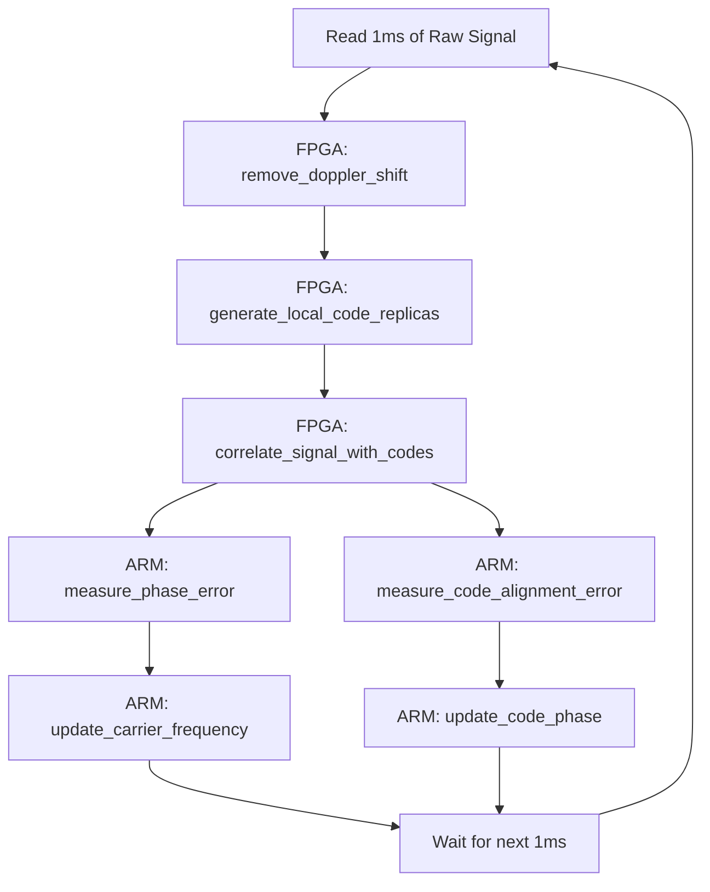
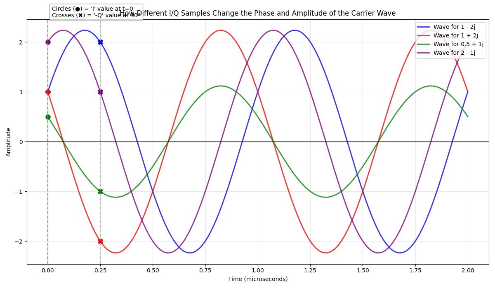
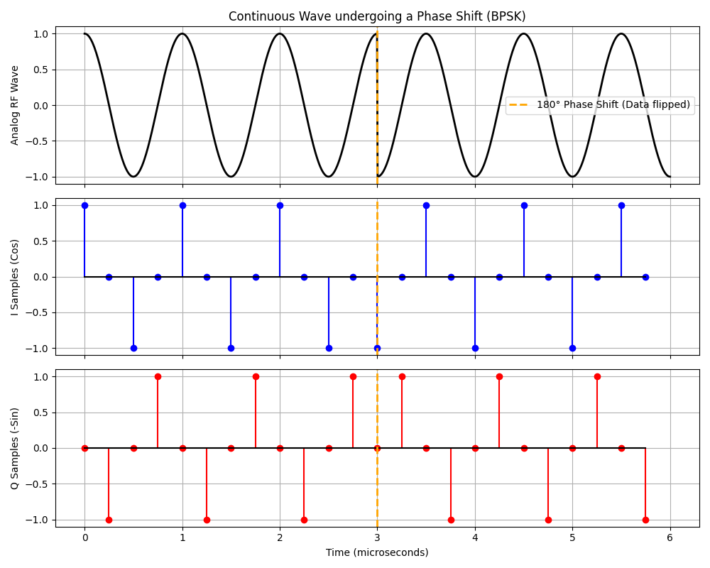
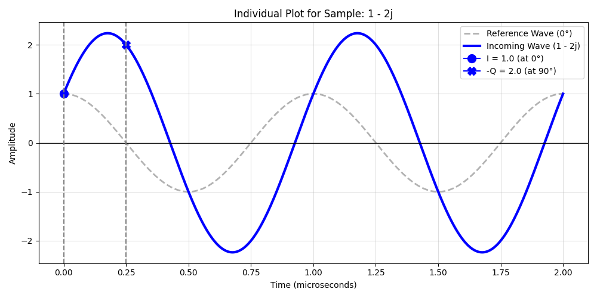
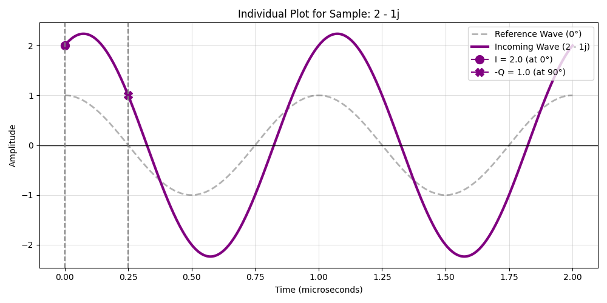

# GPS L1 C/A Baseband Tracking Engine (FPGA)

 *(Note: Hardware tracking output plot)*

## 🚀 Project Overview

This repository contains a high-performance, real-time **GPS L1 C/A Baseband Tracking Engine** deployed directly onto a Xilinx Zynq-7000 FPGA (PYNQ-Z2). It is capable of tracking multiple GPS satellites simultaneously using a mathematically proven, hardware-in-the-loop validated **Native VHDL** DSP architecture.

Originally prototyped in High-Level Synthesis (HLS), the entire Digital Signal Processing (DSP) datapath was completely reverse-engineered and rewritten into highly optimized, modular, and cycle-accurate structural VHDL. This migration drastically reduced latency, eliminated black-box state machines, and provided true deterministic, single-cycle integration throughput.

## 🧠 Core Architecture (Native VHDL)

The `v4_final_delivery/src_vhdl` directory contains the production-ready IP core. The hardware architecture features:

- **Carrier NCO (`carrier_nco.vhd`)**: A precision 32-bit Phase Accumulator coupled with a custom Sine/Cosine ROM for local carrier wipeoff.
- **Code NCO (`code_nco.vhd`)**: A 33-bit Phase Accumulator designed to handle high-frequency Doppler shifts without mathematical wrap-around vulnerabilities.
- **Gold Code Generator (`ca_code_rom.vhd`)**: Real-time PRN sequence generation for all GPS satellites.
- **Correlators (`correlator.vhd`)**: Cycle-aligned Early, Prompt, and Late (E/P/L) integrators for both In-phase (I) and Quadrature (Q) arms.
- **AXI Integration (`gps_tracker_config/status.vhd`)**: The core communicates with the Zynq ARM processor (PS) via AXI-Stream for high-bandwidth raw RF I/Q data, and AXI-Lite for configuration and status registers.

## 🔬 Mathematical Hardware Verification

Hardware is only as good as the math it computes. To guarantee bit-accuracy, we developed a rigorous **Hardware-in-the-Loop (HIL)** verification pipeline:

1. **Real-world Data Injection**: 1-second snapshots of raw GPS RF I/Q baseband data are loaded into the FPGA's DDR memory and streamed into the PL via DMA.
2. **Hardware Acceleration**: The Native VHDL pipeline processes 1ms epochs (4,000 samples) in real-time, wiping off the carrier and accumulating the correlation results.
3. **Closed-loop Tracking**: The ARM PS reads the hardware integrators via AXI-Lite, runs the Discriminator algorithms, and updates the NCOs for the next epoch.
4. **Validation against Float64 Model**: The hardware tracking history (Doppler frequency, PLL/DLL errors) is exported and mathematically compared against a theoretical pure-Python float64 reference model.

**Verdict**: The Native FPGA hardware successfully locks onto all available satellites (PRN 16, 26, 29, 31) and matches the float64 tracking model to within the acceptable DSP noise floor margin (<20Hz drift over 500 epochs).

## 📂 Repository Structure

* `v4_final_delivery/`: The polished, final delivery folder containing the Native VHDL source code, the Vivado build script, and the Python hardware validation deployment scripts.
* `v3_hls_to_vhdl/`: The development and staging area where the gap analysis and migration from HLS to VHDL took place. Includes XSim simulation testbenches.
* `v2/` & `v1/`: Earlier iterations of the DSP architecture (HLS pipelines and initial Python software models).

## 🛠️ Tech Stack & Skills Demonstrated

- **Hardware Design**: VHDL, RTL Design, Digital Signal Processing (DSP), Clock Domain Crossing, Fixed-Point Arithmetic.
- **FPGA Toolchain**: Xilinx Vivado, IP Packager, Block Design automation via Tcl, XSim.
- **Embedded Software**: Python, PYNQ framework, Zynq Processing System (PS) to Programmable Logic (PL) communication (AXI4-Lite, AXI4-Stream, DMA).
- **Domain Expertise**: GNSS Baseband Processing, Phase-Locked Loops (PLL), Delay-Locked Loops (DLL), Numerically Controlled Oscillators (NCO).


# Engineering Journal & Architectural Deep Dives

This journal documents the core architectural decisions, theoretical experiments, and technical deep-dives undertaken during the development of the GPS L1 C/A Baseband Tracking Engine.

## Table of Contents

- [Why Build a Custom FPGA Tracker? (COTS vs Custom)](#why-build-a-custom-fpga-tracker?-cots-vs-custom)
- [High-Level Tracking Algorithm Overview](#high-level-tracking-algorithm-overview)
- [Algorithm Prototyping: Python vs Hardware Execution](#algorithm-prototyping-python-vs-hardware-execution)
- [Python Float64 Baseline: Function Mapping](#python-float64-baseline-function-mapping)
- [FPGA Throughput & Hardware Acceleration Advantages](#fpga-throughput-hardware-acceleration-advantages)
- [Data Bandwidth & System Throughput Requirements](#data-bandwidth-system-throughput-requirements)
- [System Output & Data Verification Strategies](#system-output-data-verification-strategies)
- [Understanding I/Q Baseband Sampling](#understanding-i/q-baseband-sampling)
- [Signal Sampling Rates & Epoch Transmission Dynamics](#signal-sampling-rates-epoch-transmission-dynamics)
- [Signal Synchronization & Sampling Start Times](#signal-synchronization-sampling-start-times)
- [Carrier Synchronization & Phase-Locked Loops](#carrier-synchronization-phase-locked-loops)
- [Doppler Shift Compensation via Numerically Controlled Oscillators (NCO)](#doppler-shift-compensation-via-numerically-controlled-oscillators-nco)
- [Carrier Wipeoff & Spinning Wave Mathematics](#carrier-wipeoff-spinning-wave-mathematics)
- [Understanding Phase in Digital Signal Processing](#understanding-phase-in-digital-signal-processing)
- [BPSK Modulation & Phase Transitions](#bpsk-modulation-phase-transitions)
- [Sliding Window Correlation Mechanics](#sliding-window-correlation-mechanics)
- [Integrate & Dump Correlation Mechanics](#integrate-dump-correlation-mechanics)
- [Visualizing Individual RF Samples](#visualizing-individual-rf-samples)
- [Data Generation & Mathematical Verification](#data-generation-mathematical-verification)
- [Mathematical Prototyping & Theoretical Experiments](#mathematical-prototyping-theoretical-experiments)
- [General Architecture Q&A](#general-architecture-qa)

---

## Why Build a Custom FPGA Tracker? (COTS vs Custom)

It's true that you can buy a commercial off-the-shelf (COTS) GPS chip for a few dollars. These chips will easily output standard NMEA sentences containing your physical position (X, Y, Z coordinates). So why go through the immense hassle of building a custom Tracking Engine on an FPGA?

Here are the primary reasons why advanced projects require custom GPS/GNSS receivers:

### 1. Access to Raw Data & Correlator Outputs
Commercial GPS chips act as **black boxes**. You feed them an antenna signal, and they give you a location. They **do not** give you access to the internal tracking loops, raw I/Q samples, or correlator outputs.
In research, defense, or high-precision surveying, engineers need this raw data to understand *how* the signal is behaving (e.g., to measure ionospheric delays or test new tracking loop designs).

### 2. Anti-Jamming and Anti-Spoofing
Standard GPS chips are highly vulnerable to jamming (overpowering the faint GPS signal with noise) and spoofing (transmitting fake GPS signals to trick the receiver). 
By building a custom tracking engine, you can implement advanced, proprietary algorithms to detect and reject spoofed signals or use specialized multi-antenna arrays (CRPA) to nullify jammers. 

### 3. Advanced Multi-Path Mitigation
In urban canyons (between tall buildings), GPS signals bounce off structures, causing "multi-path" errors. A custom engine allows you to implement highly specialized, narrow-correlator algorithms to distinguish between the true direct line-of-sight signal and the bounced echoes.

### 4. Ultra-Tight Integration (e.g., with INS)
Standard receivers only let you integrate GPS data with Inertial Navigation Systems (INS/IMUs) at the *position* or *velocity* level. A custom FPGA receiver allows for **ultra-tight coupling**. This means the IMU data directly assists the internal PLL/DLL tracking loops, allowing the receiver to maintain a lock on the satellite signal even during extreme dynamics (like a high-speed drone or aerospace vehicle) where a standard chip would instantly lose track.

### 5. Control over Intellectual Property (IP) and Security
For defense, space, or proprietary commercial products, relying on a third-party (often foreign-manufactured) silicon chip is a security and supply-chain risk. Building the baseband processing on an FPGA means the organization completely owns the IP and can audit every single line of code/RTL for security.

### 6. Flexibility and Software-Defined Radio (SDR)
A custom FPGA-based receiver is highly flexible. If a new GNSS constellation is launched, or a new signal frequency is added (like L1C or L5), a standard chip might become obsolete. A custom FPGA engine can simply be reprogrammed via a firmware update to track the new signals.

---

**Summary:** 
Buying a chip is perfect for consumer electronics like smartphones. Building a custom tracking engine is essential when you need absolute control, extreme resilience against interference, cutting-edge precision, or custom integration that standard chips simply cannot provide.

---

## High-Level Tracking Algorithm Overview

To bridge the gap between complex mathematics and human understanding, we have abstracted the math into named functions. This allows us to read the algorithm like a story, focusing on *what* the system is doing rather than the mathematical mechanics of *how* it does it.

## 1. The High-Level Flow Chart

Here is the tracking loop, using only the names of our human-readable functions:



## 2. The Pseudo-Code Algorithm

This is the main tracking loop written in plain English. It clearly separates what runs on the fast hardware (FPGA) and what runs on the slower control processor (ARM).

```python
def track_satellite_for_one_millisecond(raw_signal):
    
    # ==========================================
    # FPGA HARDWARE (High-Speed Processing)
    # ==========================================
    
    # Step 1: Wipe off the high-frequency radio carrier
    baseband_signal = remove_doppler_shift(raw_signal, current_frequency)
    
    # Step 2: Create local guesses of what the satellite code looks like
    early_code, prompt_code, late_code = generate_local_code_replicas(current_code_phase)
    
    # Step 3: Multiply and sum (correlate) to pull the GPS data out of the noise
    correlation_results = correlate_signal_with_codes(
        baseband_signal, 
        early_code, prompt_code, late_code
    )
    
    # ==========================================
    # ARM PROCESSOR (Low-Speed Control Loops)
    # ==========================================
    
    # Step 4: Check if our frequency guess was slightly off
    phase_error = measure_phase_error(correlation_results.prompt)
    update_carrier_frequency(phase_error)
    
    # Step 5: Check if our code alignment was slightly early or late
    alignment_error = measure_code_alignment_error(correlation_results.early, correlation_results.late)
    update_code_phase(alignment_error)
```

## 3. The Function Definitions (What happens inside)

Here are the "blank functions" that hide the complex math. If we ever need to see the math, we look inside these functions. Otherwise, we just trust the name of the function to tell us what it accomplishes.

```python
def remove_doppler_shift(raw_signal, estimated_frequency):
    """
    Creates local sine and cosine waves at the estimated_frequency.
    Multiplies the raw_signal by these waves to strip away the radio carrier.
    Returns the clean baseband signal.
    """
    pass # (Cosine/Sine generation and complex multiplication math goes here)

def generate_local_code_replicas(current_code_phase):
    """
    Generates three versions of the satellite's unique ID pattern (C/A code):
    - Early: Shifted slightly backward in time
    - Prompt: Exactly where we think the satellite is
    - Late: Shifted slightly forward in time
    """
    pass # (PRN shift and generation math goes here)

def correlate_signal_with_codes(baseband_signal, early, prompt, late):
    """
    Multiplies the baseband_signal by the early, prompt, and late codes.
    Sums up all 4,000 samples for each. If they match, the sum is a huge spike.
    Returns the energy levels for Early, Prompt, and Late.
    """
    pass # (NumPy dot-product arrays and accumulation math goes here)

def measure_phase_error(prompt_energy):
    """
    Looks at the Prompt energy. If it is completely "In-Phase", the error is 0.
    If it has bled into the "Quadrature" phase, we use trigonometry
    to calculate exactly how many degrees off we are.
    """
    pass # (Arctan and modulo math goes here)

def update_carrier_frequency(phase_error):
    """
    Takes the phase_error and passes it through a Phase Locked Loop (PLL) filter.
    Adjusts the estimated_frequency so we are more accurate in the next millisecond.
    """
    pass # (PLL loop filter multiplication math goes here)

def measure_code_alignment_error(early_energy, late_energy):
    """
    Compares the Early energy to the Late energy.
    If Early > Late, we are tracking too early.
    If Late > Early, we are tracking too late.
    """
    pass # (Energy comparison and division math goes here)

def update_code_phase(alignment_error):
    """
    Takes the alignment_error and passes it through a Delay Locked Loop (DLL) filter.
    Adjusts the current_code_phase so our code generator stays perfectly centered.
    """
    pass # (DLL loop filter multiplication math goes here)
```

---

## Algorithm Prototyping: Python vs Hardware Execution

## 1. Did we do this in Python already?
Yes! In Milestone 1, we built a pure software prototype. The "thousands of complex multiplications" were handled by Python using the `NumPy` library. 

### Where is the Python Code?
You can find the exact location of these multiplications in the Python dispatch version here:
[02_track.py](file:///d:/GPS_M1/m1_python/02_track.py#L140-L159)

Here is the full tracking loop snippet, using a `diff` block to highlight the architectural split in different colors for your Obsidian note:
- **Green (`+`)** represents the high-speed math now offloaded to the **FPGA (PL)**.
- **Red (`-`)** represents the low-speed control logic that remains on the **ARM CPU (PS)**.

```diff
+ # ==========================================
+ #  [RUNS ON FPGA - PL / PROGRAMMABLE LOGIC]
+ #  High-speed Math (4,000,000 times a sec)
+ # ==========================================
+ # 1. CARRIER WIPE-OFF
+ ci = np.cos(2*np.pi*(fc*t + phi)).astype(np.float32)
+ cq = -np.sin(2*np.pi*(fc*t + phi)).astype(np.float32)
+ 
+ bi = seg.real*ci - seg.imag*cq
+ bq = seg.real*cq + seg.imag*ci
+ 
+ # 2. CODE GENERATION
+ dp_frac = j * CPS
+ ce = rep(self.code, dp_frac, -0.5, n)
+ cpp = rep(self.code, dp_frac, 0.0, n)
+ cl = rep(self.code, dp_frac, +0.5, n)
+ 
+ # 3. CORRELATION (Multiply and Accumulate)
+ Ip = float(bi@cpp)/n
+ Qp = float(bq@cpp)/n
+ Ie = float(bi@ce)/n
+ Qe = float(bq@ce)/n
+ Il = float(bi@cl)/n
+ Ql = float(bq@cl)/n
+ 
+ E = float(np.sqrt(Ie*Ie+Qe*Qe))
+ L = float(np.sqrt(Il*Il+Ql*Ql))
+ 
- # ==========================================
- #  [RUNS ON ARM CPU - PS / PROCESSING SYSTEM]
- #  Low-speed Control Loops (1,000 times a sec)
- # ==========================================
- self.ch_lock += 1
- 
- # 4. FLL / PLL LOOP FILTER (Adjusting frequency)
- if self.ch_lock < FLL_EPOCHS:
-     if self.ch_lock >= 2:
-         dot = Ip * self.prev_Ip + Qp * self.prev_Qp
-         cross = Ip * self.prev_Qp - Qp * self.prev_Ip
-         if dot != 0.0:
-             err_freq = np.arctan(cross / dot) / (2.0 * np.pi)
-             self.fd -= B_FLL / 0.25 * err_freq
-     pe = float(np.arctan2(Qp, Ip))
- else:
-     if Ip != 0.0:
-         err_phas = np.arctan(Qp / Ip) / (2.0 * np.pi)
-         W = B_PLL / 0.53
-         self.fd += 1.4 * W * (err_phas - self.err_phas_prev) + W * W * err_phas * T
-         self.err_phas_prev = err_phas
-     pe = float(np.arctan2(Qp, Ip))
-     
- # 5. DLL LOOP FILTER (Adjusting code alignment)
- de = 0.0
- if E + L > 0.0:
-     err_code = (E - L) / (E + L) / 2.0 * T / N_CHIPS
-     self.coff -= B_DLL / 0.25 * err_code * T
-     de = (E - L) / (E + L) / 2.0
-     
- self.prev_Ip = Ip
- self.prev_Qp = Qp
```

## 2. Are we doing this in the FPGA now?
Yes! In the current milestones, we are migrating the **Green** calculations to the FPGA's Programmable Logic (PL), and keeping the **Red** calculations in Python/C on the ARM CPU (PS).

### Why the FPGA?
The green calculations above look like just a few lines of Python, but they are hiding a massive amount of math:
- The variable `n` is usually 4,000 samples (for 1 millisecond of data).
- To track **one** satellite, Python has to perform thousands of multiplications to wipe off the carrier (`ci`, `cq`), and then thousands more to do the dot products for Early, Prompt, and Late codes.
- To get a 3D position fix, we need to track **at least 4 satellites** simultaneously, and ideally 8-12.
- A standard CPU processing these NumPy arrays sequentially struggles to keep up with the 4 Million Samples Per Second data rate in real-time. Power consumption is also very high.

**The FPGA Advantage:**
Instead of a CPU executing instructions one by one, an FPGA creates dedicated hardware circuits for these math operations. The FPGA can multiply all the samples for Carrier Wipe-off and Code Correlation simultaneously using massive parallelism. It can run multiple satellite tracking "channels" independently, taking only a fraction of the power and time, while the ARM processor (PS) is left free to handle the lightweight high-level loop filters and navigation math (the **Red** part).

## 3. Step-by-Step Code Explanation

Let's break down exactly what the math is doing in physical terms.

### The FPGA Part (High-Speed Data Processing)
The FPGA receives the raw, noisy digital signal from the antenna at 4 Million Samples Per Second. 

```python
ci = np.cos(2*np.pi*(fc*t + phi)).astype(np.float32)
cq = -np.sin(2*np.pi*(fc*t + phi)).astype(np.float32)

bi = seg.real*ci - seg.imag*cq
bq = seg.real*cq + seg.imag*ci

ce = rep(self.code, dp_frac, -0.5, n)  # Early: shifted half a chip backward
cpp = rep(self.code, dp_frac, 0.0, n)  # Prompt: perfectly aligned
cl = rep(self.code, dp_frac, +0.5, n)  # Late: shifted half a chip forward

Ip = float(bi@cpp)/n   # In-phase Prompt  (contains the actual Navigation Data)
Qp = float(bq@cpp)/n   # Quadrature Prompt (used to measure phase error)
Ie = float(bi@ce)/n    # Early energy 
Qe = float(bq@ce)/n
Il = float(bi@cl)/n    # Late energy
Ql = float(bq@cl)/n

E = float(np.sqrt(Ie*Ie+Qe*Qe))
L = float(np.sqrt(Il*Il+Ql*Ql))
```

### The ARM PS Part (Low-Speed Loop Filters)
Once the FPGA boils down 4,000 samples into just 6 correlation numbers (`Ip, Qp, Ie, Qe, Il, Ql`), it hands them to the ARM processor. The ARM uses these numbers to figure out if our local replicas are drifting away from the true satellite signal, and adjusts them for the next millisecond.

```python
err_phas = np.arctan(Qp / Ip) / (2.0 * np.pi)

self.fd += 1.4 * W * (err_phas - self.err_phas_prev) + W * W * err_phas * T

err_code = (E - L) / (E + L) / 2.0 * T / N_CHIPS

self.coff -= B_DLL / 0.25 * err_code * T
```


[[once again the same code with comments and explanation what are we doin there ]]

---

## Python Float64 Baseline: Function Mapping

In Milestone 1 (your Python implementation), we implemented exactly what the FPGA does, but using software arrays.

### Where did this happen?
This happens inside the **Tracking Loop** (typically a function named `track()` or inside a `PLL/DLL` loop). 

### How did we do it?
In Python, we mathematically generated a spinning complex sine wave (the digital NCO) that matches the exact Doppler frequency we found during the Acquisition phase.

```python

local_carrier = np.exp(-1j * 2 * np.pi * carrier_freq * t)

baseband_signal = incoming_samples * local_carrier
```

Once the `baseband_signal` is created, the Doppler is completely wiped out, leaving the signal perfectly at 0 Hz (Zero-IF) so we can multiply it by the PRN code and integrate!

In the FPGA, you don't use `np.exp()`. Instead, you use a hardware **LUT (Look-Up Table)** inside the NCO block, which outputs pre-calculated sine and cosine values at a very fast hardware clock speed.

---

## FPGA Throughput & Hardware Acceleration Advantages

When you hear that a modern CPU runs at 4.0 GHz, but an FPGA only runs at 100 MHz or 200 MHz, it is easy to assume the FPGA is slow. However, for specific tasks like GPS signal processing, an FPGA will obliterate a high-end CPU. 

Here are 20 general idea points explaining exactly how fast an FPGA operates and *why* it is so fast.

### The Fundamental Difference (Hardware vs Software)
1. **No Instructions to Fetch:** A CPU spends most of its time fetching an instruction from memory, decoding it, executing it, and writing back the result. An FPGA has no instructions; it is a physical electrical circuit. Data simply flows through it instantly.
2. **True Spatial Computing:** CPUs compute in *time* (one step after another). FPGAs compute in *space* (data flows through physical logic gates laid out across the silicon chip).
3. **No Operating System Overhead:** There is no Windows or Linux OS to interrupt the processor, no background tasks, and no context switching. The FPGA is 100% dedicated to its circuit.
4. **No Cache Misses:** A CPU freezes for hundreds of clock cycles if it needs data that isn't in its L1 cache. FPGAs have Distributed RAM placed directly next to the logic gates, meaning memory access is instantaneous (zero-wait-state).

### The Power of Massive Parallelism
5. **Simultaneous Execution:** If you need to add 100 different pairs of numbers, a CPU must do it 100 times in a loop. An FPGA can physically build 100 separate adders and do all 100 additions at the exact same nanosecond.
6. **Clock Speed vs Throughput:** A 4.0 GHz CPU might take 10 clock cycles to complete one math operation (400 million ops/sec). A 100 MHz FPGA running 100 parallel adders executes 10 Billion ops/sec. Throughput destroys raw clock speed.
7. **Perfect Scalability:** In your GPS project, tracking 1 satellite takes `X` amount of time on a CPU. Tracking 12 satellites takes `12X` time. On an FPGA, tracking 12 satellites takes the **exact same amount of time** as tracking 1 satellite; you just copy-paste the circuit 12 times on the silicon.
8. **Dedicated DSP Slices:** Modern FPGAs have thousands of hard-silicon "Digital Signal Processing" (DSP) blocks. These are dedicated multiplier-accumulators (MACs) that can multiply two large numbers and add them to a running total in a single clock cycle.

### Deterministic Speed and Pipelining
9. **Nanosecond Predictability:** Because it's hardware, timing is strictly deterministic. You can guarantee mathematically that an operation will take exactly, for example, 30.000 nanoseconds every single time.
10. **Zero Jitter:** CPUs suffer from "jitter" (unpredictable slight delays caused by the OS). In high-speed radio tracking, jitter destroys the correlation. FPGAs have zero jitter.
11. **Pipelining (The Assembly Line):** FPGAs break complex math into stages (like a factory assembly line). While step 3 is finishing one sample, step 2 is working on the next sample. This means the FPGA outputs a finished, complex math result on *every single clock cycle* (Initiation Interval = 1).
12. **Loop Unrolling:** When programming an FPGA in HLS, you can "unroll" a `for` loop. If a loop repeats 16 times, the FPGA physically builds 16 copies of the circuit so the whole loop finishes instantly instead of taking 16 iterations.

### Data Handling and I/O
13. **Custom Data Widths:** A CPU forces you to use 32-bit or 64-bit registers, even if your GPS data is only 2 bits wide (wasting massive bandwidth). An FPGA lets you create exactly 2-bit wide wires, meaning you can pack and move exponentially more data simultaneously.
14. **Direct Pin-to-Pin Processing:** Data coming from the antenna pin doesn't have to wait to be buffered into RAM. It can flow directly from the input pin, through the math logic, and out to the output pin with mere nanoseconds of latency.
15. **Terabit I/O Bandwidth:** High-end FPGAs have hundreds of external pins and ultra-fast SerDes transceivers that can ingest terabits of data per second—far more than a CPU motherboard bus can handle.

### Real-World FPGA GPS Math
16. **The Correlator Math:** At 16 MHz, a single GPS channel does 16 million multiplies and additions per second for just *one* correlator. 
17. **The 12-Channel Load:** A standard 12-channel receiver with 6 correlators per channel (Early/Prompt/Late for I/Q) requires **1.15 Billion** multiply-accumulate operations every single second, just to stay locked.
18. **The CPU Wall:** A standard ARM processor will hit 100% CPU usage, overheat, and drop data packets trying to maintain 1.15 Billion continuous DSP operations per second.
19. **The FPGA Breeze:** An entry-level Zynq-7000 FPGA handles those 1.15 Billion operations effortlessly, using only a tiny fraction of its total available logic gates, and barely gets warm. 
20. **Extreme Energy Efficiency:** Because the FPGA isn't powering a massive OS, branch predictors, and cache controllers, it provides massive compute-per-watt. It is the only way to put high-speed DSP processing into a battery-powered device or a satellite in space.

---

## Data Bandwidth & System Throughput Requirements

The GPS L1 C/A code transmits at exactly **1.023 MHz** (1.023 million "chips" or bits per second).

To successfully capture this without losing data, the Nyquist theorem states you MUST sample at a bare minimum of **2x** the signal rate (so > 2.046 MHz). However, 2x can be very "blurry" in practice. Professional GPS receivers (and the MAX2771 chip you are using) typically sample at **4x** (around 4.092 MHz) or even **16x** (16.368 MHz).

If you are sampling at 4x (4 million samples per second), and each sample is a packed 2-bit I/Q word, you are generating about **2 Megabytes of raw data every single second**.

If you sample at 16x, you are taking 16,368,000 samples *every single second* just to look at the sky! This is why normal computer CPUs choke and you need an FPGA to chew through the massive firehose of data instantly.

---

## System Output & Data Verification Strategies

### The Short Answer:
**Not yet.** In Milestone 1 (and the current FPGA implementation in Milestone 2/3), we have only built the **Acquisition** and **Tracking Loops**. 

### What are we getting right now?
Right now, your program outputs:
1. **Correlation Peaks:** Proving we can find the satellite in the noise.
2. **Locked NCO Frequencies:** Proving we can track the Doppler shift over time.
3. **Locked PRN Delays:** Proving we can track the Code Phase.
4. **I/Q Prompt Values:** A steady stream of values that occasionally flip from positive to negative.

### What is missing? (The Next Steps)
Those `I_Prompt` values flipping from positive to negative **ARE** the hidden Ephemeris data! 

However, to actually turn those flips into a physical X, Y, Z location on a map, you need to build a **Navigation Decoder** in software (typically on the ARM processor).

Here is what the software must do next:
1. **Bit Synchronization:** The tracking loop dumps data every 1 millisecond. But a GPS data bit lasts 20 milliseconds. The software must figure out exactly which 1ms dump represents the "start" of a new 20ms bit.
2. **Frame Synchronization (Finding the Preamble):** Once you have clean 20ms bits (1s and 0s), you have to find the start of a "Subframe". The software scans the 1s and 0s looking for a specific 8-bit pattern: `10001011` (The Preamble).
3. **Parity Checking:** The satellite sends checksums to ensure the data wasn't corrupted by noise. The software must run the math to verify the bits are perfect.
4. **Decoding the Ephemeris:** Once the frames are verified, the software parses the binary data into actual floating-point numbers: "The satellite's exact orbital trajectory is X, the time is exactly Y."
5. **PVT Calculation (Position, Velocity, Time):** Finally, using the Ephemeris data from 4 different satellites, and the exact nanosecond delay from your Tracking Loops, you run the massive Least-Squares math equation to calculate your location on Earth.

**Conclusion:** 
You have built the Engine. The Engine is perfectly tracking the satellites and pulling the raw binary data out of the noise. The next logical step (often handled in later milestones or higher-level software like RTKLIB) is to write the parser that reads those binary bits and does the geometry math!

---

## Understanding I/Q Baseband Sampling

Let's clear up the confusion immediately! The previous plot was misleading because the blue (I) and red (Q) dots were overlapping, making it look like they were sampled at different times.

**Crucial Fact #1:** I and Q are sampled at the **exact same instant in time**. For every microsecond, the hardware takes ONE snapshot, but that snapshot is split into two dimensions (I and Q).

---

## 1. What does a single sample like "1 - 2j" actually mean?

You asked: *"So if I have got this data 1i-2j, what does it mean? Show me this on a graph overlaid on a sine with sample lines."*

In our software, `1 - 2j` is a complex number where:
- **I (In-Phase / Real part) = 1.0**
- **Q (Quadrature / Imaginary part) = -2.0**

But what does this mean in the physical world? A single complex sample like `1 - 2j` actually defines an **entire continuous radio wave** for that instant. It tells us the exact Amplitude and the exact Phase (starting angle) of the wave.

Here is the plot showing the exact physical radio wave that `1 - 2j` represents:


> [!NOTE]
> Look at the blue dot at Time = 0. The actual height of the analog wave is exactly **1.0**. This is your **I** value! The **Q** value of -2.0 determines how far the wave is shifted horizontally, which you can see dictates the height of the wave at the 90° mark.

By passing `1 - 2j` into our FPGA, we have perfectly described that entire grey continuous wave using just two numbers.

### Comparing Multiple Complex Samples
To see exactly how different I/Q values change the actual physical wave, let's plot the 4 complex samples you asked for (`1-2j`, `1+2j`, `0.5+1j`, and `2-1j`) right on top of each other:



> [!TIP]
> Notice how the **Circles (I value)** perfectly dictate the starting height of the wave at `Time = 0`, and the **Crosses (-Q value)** dictate the height of the wave exactly 90 degrees later! By changing the I and Q numbers, we can stretch the wave taller, or drag it left and right (phase shift).
---

## 2. Seeing a Phase Shift (BPSK Modulation)

You asked: *"I want to see this when there is a modulation of phase shift and the effect on the I and Q values."*

GPS uses a modulation technique called **BPSK** (Binary Phase Shift Keying). When a satellite wants to transmit a bit of data, it abruptly flips the radio wave upside down (a 180-degree phase shift). 

Let's look at a continuous wave that flips 180 degrees at the 3-microsecond mark. To avoid the overlapping confusion, I have separated the **I samples** and **Q samples** onto their own graphs so you can see exactly how they react simultaneously.



> [!TIP]
> **Look at the Orange Line!** When the analog wave flips upside down, the I and Q samples instantly flip their signs too. This is exactly how the FPGA reads the GPS Navigation Data: it looks for these sudden inversions in the I/Q data stream.

---

## Signal Sampling Rates & Epoch Transmission Dynamics

### The Misconception
*What do we mean by a single sample? Does the GPS satellite transmit, wait, and then transmit again?*

### The Reality
The satellite absolutely does **NOT** wait! It transmits a continuous, never-ending, uninterrupted analog radio wave, much like a continuously flowing river or a beam of light.

### So, what is a "Sample"?
A "sample" is an action that *our hardware* takes here on Earth. 

The ADC (Analog-to-Digital Converter) takes a microscopic "snapshot" of that continuous analog wave's voltage level. It is exactly like recording a continuously flowing river by snapping digital photographs very quickly.

If we are sampling at **16.368 MHz**, it means our ADC chip is taking **16,368,000 voltage snapshots every single second**. 
The river never stops flowing; we are just freezing it into millions of tiny, discrete numbers so a digital computer can process it.

We do this for the *entire sky* at once. A single sample contains the overlapping, mashed-together radio energy of every single GPS satellite in view, all frozen at that exact nanosecond in time.

---

## Signal Synchronization & Sampling Start Times

### The Problem
*“But I don't start sampling it just at the beginning of the packet. So once again 1 ms might contain data from the previous packet and the current packet.”*

This is an incredibly sharp observation. You have just identified the exact reason why GPS receivers must perform **Acquisition** and **Code Tracking**!

When you turn on your ADC (like the MAX2771) and grab a random 1-millisecond chunk of data (16,368 samples), you are blindly grabbing a slice of time. The satellite did not wait for you. 
Therefore, your random 1ms slice will almost certainly contain the *tail end* of one PRN barcode, and the *beginning* of the next PRN barcode.

### Why is this a problem?
If you take this misaligned 1ms chunk of live data, and multiply it by your perfectly aligned internal PRN barcode, the math fails. 
* The first half of your math is multiplying against the end of the previous PRN code.
* The second half of your math is multiplying against the beginning of the new PRN code.
Because the codes are misaligned, the multiplication looks like random noise, and the "Integrate and Dump" sum will equal `0`. You will see nothing.

### The Solution: Finding the Code Phase

To solve this, we don't try to change when the antenna samples the data. The antenna just streams data constantly. Instead, we **shift our internal PRN barcode** to match the live data!

#### 1. The Acquisition Phase (The Brute Force Search)
During startup, the receiver does a brute-force search. 
It takes that random 1ms chunk of live data, and it tests it against every possible shift of the internal PRN barcode.
If your ADC samples at 16 MHz, there are 16,368 possible ways the barcode could be shifted. The receiver shifts its internal barcode by 1 sample, multiplies, and checks the sum. Then it shifts by 2 samples, multiplies, and checks the sum. 

Eventually, it shifts its internal barcode to the exact nanosecond where the live data's PRN code begins. **BOOM.** The math perfectly aligns, the "Integrate and Dump" outputs a massive positive spike, and the receiver now knows the exact **Code Phase** (the exact starting sample of the satellite's packet).

#### 2. The Tracking Phase (The Delay Lock Loop)
Once you find the start of the packet, you lock onto it.
Because the satellite is moving, the start of the next packet might arrive slightly sooner or slightly later than exactly 1 millisecond.
The **Delay Lock Loop (DLL)** uses the Early and Late correlators to constantly monitor the edges of the packet. If it sees the packet shifting slightly to the left, it tells the FPGA to shift your internal barcode slightly to the left to keep them perfectly locked together.

### Summary
You are exactly right: a random 1ms block of samples will contain pieces of two different packets. The entire point of the GPS baseband engine is to digitally slide our internal reference backwards and forwards in time until it perfectly overlays the invisible boundaries of the live packets falling from space.

---

## Carrier Synchronization & Phase-Locked Loops

### *Are we synchronizing with the exact frequency of the satellite using the NCO?*
**Yes, absolutely.** The satellite transmits at 1575.42 MHz, but because it is moving, the Doppler effect changes this frequency (e.g., to 1575.423 MHz). The NCO must spin at the exact opposite frequency to cancel out this Doppler shift so the result is perfectly 0 Hz.

### *What do we have to do every millisecond, every time?*
The tracking loop operates on a strict 1-millisecond heartbeat. Here is the exact sequence of events that happens 1,000 times every single second:

1. **The Dump:** At the end of the millisecond, the FPGA dumps the 6 Correlator values (I_Early, Q_Early, I_Prompt, Q_Prompt, I_Late, Q_Late).
2. **The Discriminator:** The CPU takes the `I_Prompt` and `Q_Prompt` and runs them through a math function (like `atan(Q/I)`). This function calculates the **Phase Error** (e.g., "The NCO is 2 degrees ahead of the satellite").
3. **The Loop Filter:** The CPU passes that error into a Loop Filter (a digital PID controller). The filter smooths out the noisy error and converts it into a velocity command.
4. **The Update:** The CPU calculates a new "Tuning Word" and writes it to the FPGA. This tells the NCO: *"Slow down your frequency by 0.5 Hz for the next millisecond to let the satellite catch up."*
5. **Repeat:** The FPGA integrates for another millisecond using the new, corrected NCO frequency.

### *How much time does it take to get in sync?*
When the tracking loop first turns on (right after Acquisition), the NCO is close to the right frequency, but the phase is messy. 

* **Pull-in Time:** It typically takes the PLL **10 to 50 milliseconds** (10 to 50 loops) to adjust the NCO and pull the phase error down to zero.
* **Steady State:** Once it is locked, it stays locked indefinitely, constantly making micro-adjustments every millisecond to fight the satellite's continuous movement.

---

## Doppler Shift Compensation via Numerically Controlled Oscillators (NCO)

### The Core Problem
*We are mixing with a fixed frequency (like 1.575 GHz) at the antenna. But the arriving frequency is Doppler shifted, and every satellite has a completely different Doppler shift because they are moving in different directions! How can we track them all at once?*

This is an incredibly smart engineering observation. 

### Step 1: The Dumb Analog Hardware
The analog hardware mixer (like the MAX2771 chip) is "dumb" and strips away a single, fixed 1.575 GHz frequency for the entire sky. 

Because it applies one fixed subtraction to everything, the data coming out of the chip is **NOT** perfectly at 0 Hz for every satellite! 
* Satellite 1 is moving towards us: It might still be spinning at **+3 kHz**.
* Satellite 4 is moving away from us: It might be spinning at **-2 kHz**.

They are all piled on top of each other in the exact same 16 MHz data stream.

### Step 2: The Digital FPGA Solution (NCOs)
This is exactly why your FPGA design has a **Digital Local Oscillator (NCO - Numerically Controlled Oscillator)** built into *every single channel*. 

The FPGA performs a **second downconversion, entirely in digital math!**
* Inside the FPGA, **Channel 1**'s NCO generates a digital sine wave spinning at exactly +3 kHz to wipe off Satellite 1's remaining Doppler.
* Meanwhile, **Channel 4**'s NCO generates a wave spinning at -2 kHz to wipe off Satellite 4's Doppler.

The analog hardware does the heavy lifting (wiping off the massive 1.5 GHz carrier), and the FPGA channels do the per-satellite fine-tuning to perfectly stop their unique Doppler spins!

---

## Carrier Wipeoff & Spinning Wave Mathematics

When we say a radio wave is "spinning," we are talking about **Phase**. A wave that is perfectly stationary sits at a constant phase angle (e.g., $0^\circ$). But if the satellite is moving towards us, the Doppler shift increases the frequency. This means the phase angle is constantly increasing over time—the wave is "spinning" in a circle.

Let's do a concrete numerical problem exactly like you would find in an engineering textbook. 

---

## 📚 The Problem Statement

A satellite is transmitting a constant value of `1`. However, because it is moving towards us, the Doppler shift causes the carrier wave to "spin" at a rate of **1 full rotation per second (1 Hz)**. 

Our ADC is taking samples at a rate of **4 samples per second ($F_s = 4$ Hz)**.

**Your Goal:** Calculate the incoming I/Q samples, generate a local counter-spinning wave, and use complex multiplication to "wipe off" the spin and recover the original constant value of `1`.

---

## Step 1: Observe the Incoming Spinning Wave

If the wave makes 1 full rotation ($360^\circ$) every second, and we take 4 samples per second, the wave will spin $90^\circ$ between each sample.

Remember: 
- **I** is the X-axis (Cosine of the angle)
- **Q** is the Y-axis (Sine of the angle)

| Time ($t$) | Phase Angle | Incoming I ($\cos$) | Incoming Q ($\sin$) | Complex Number representation |
| :--- | :--- | :--- | :--- | :--- |
| $t = 0.00$s | $0^\circ$ | `1` | `0` | **`1 + 0j`** |
| $t = 0.25$s | $90^\circ$ | `0` | `1` | **`0 + 1j`** |
| $t = 0.50$s | $180^\circ$ | `-1` | `0` | **`-1 + 0j`** |
| $t = 0.75$s | $270^\circ$ | `0` | `-1` | **`0 - 1j`** |

> [!CAUTION]
> Notice what is happening to our data? The satellite is trying to send us a constant `1`, but because of the Doppler spin, our data is wildly swinging from `1`, to `1j`, to `-1`, to `-1j`. If we tried to decode this right now, it would look like gibberish.

---

## Step 2: Generate the Local "Counter-Spinning" Wave

To stop the spin, the FPGA generates its own local wave (the NCO). If the incoming wave is spinning forward at +1 Hz, our FPGA must generate a wave spinning **backward at -1 Hz**.

This means our local angle decreases by $90^\circ$ every sample.

| Time ($t$) | Local Angle | Local I ($\cos$) | Local Q ($\sin$) | Complex Number representation |
| :--- | :--- | :--- | :--- | :--- |
| $t = 0.00$s | $0^\circ$ | `1` | `0` | **`1 + 0j`** |
| $t = 0.25$s | $-90^\circ$ | `0` | `-1` | **`0 - 1j`** |
| $t = 0.50$s | $-180^\circ$ | `-1` | `0` | **`-1 + 0j`** |
| $t = 0.75$s | $-270^\circ$ | `0` | `1` | **`0 + 1j`** |

---

## Step 3: Carrier Wipe-Off (The Math)

Now for the magic. We multiply the Incoming Wave by the Local Wave. 
Recall the formula for complex multiplication you learned in algebra: 
$(A + jB) \times (C + jD) = (AC - BD) + j(AD + BC)$

Let's do the math manually for each sample!

#### At $t = 0.00$s:
- Incoming: `1 + 0j`
- Local: `1 + 0j`
- Multiplication: $(1\times1 - 0\times0) + j(1\times0 + 0\times1)$ = **`1 + 0j`**

#### At $t = 0.25$s (The incoming wave has spun $90^\circ$):
- Incoming: `0 + 1j`
- Local: `0 - 1j`
- Multiplication: $(0\times0 - 1\times-1) + j(0\times-1 + 1\times0)$
- Multiplication: $(0 - (-1)) + j(0 + 0)$ = **`1 + 0j`**

#### At $t = 0.50$s (The incoming wave has spun $180^\circ$):
- Incoming: `-1 + 0j`
- Local: `-1 + 0j`
- Multiplication: $(-1\times-1 - 0\times0) + j(-1\times0 + 0\times-1)$ = **`1 + 0j`**

#### At $t = 0.75$s (The incoming wave has spun $270^\circ$):
- Incoming: `0 - 1j`
- Local: `0 + 1j`
- Multiplication: $(0\times0 - -1\times1) + j(0\times1 + -1\times0)$
- Multiplication: $(0 - (-1)) + j(0 + 0)$ = **`1 + 0j`**

---

## 🎯 The Conclusion

Look at the final results! 
Before the math, our data was spinning in circles: `(1) -> (1j) -> (-1) -> (-1j)`.
After multiplying by our local counter-spinning wave, the result is completely flat: `(1) -> (1) -> (1) -> (1)`.

We have successfully **stopped the spin** (Carrier Wipe-Off), and recovered the original, stable data that the satellite transmitted! This is exactly what the Python code `bi = seg.real*ci - seg.imag*cq` is doing millions of times a second.

---

## Understanding Phase in Digital Signal Processing

You asked some incredibly profound questions that cut straight to the core of radio engineering:
1. *What is phase really here with respect to? Compare it to what?*
2. *I plot a line at a 45-degree angle. What does it mean?*
3. *Does this line belong to the carrier wave or the data?*

Let's break these down one by one, using a visual graph to anchor the concepts.

---

## 1. Phase is ALWAYS a Comparison
Phase does not exist in a vacuum. It is a measurement of **Time Delay** expressed as an angle. 

When we say a wave has a "45-degree phase," you must immediately ask: *"45 degrees compared to what?"*

In our GPS receiver, the phase is compared to the **FPGA's internal clock (The Reference Wave)**. 
- The FPGA generates its own perfect, internal cosine wave. We call this $0^\circ$.
- If the incoming satellite wave peaks at the exact same microsecond as the FPGA's wave, they are "in-phase" ($0^\circ$).
- If the incoming wave peaks slightly *earlier* or *later* than the FPGA's wave, that delay is the **Phase Shift**.

## 2. What does a 45-Degree Line on a Graph Mean?

When you plot a line on Cartesian coordinates (the I/Q plane), here is exactly what you are drawing:


> [!NOTE]
> **Left Graph (The Cartesian I/Q Plane):** 
> - The **X-Axis (I)** represents our FPGA's internal Cosine wave ($0^\circ$).
> - The **Y-Axis (Q)** represents our FPGA's internal Sine wave ($90^\circ$).
> - **The Blue Line:** This represents the incoming satellite wave at a specific microsecond. The fact that it is pointing at $45^\circ$ means it is a perfect 50/50 mixture of our Cosine and Sine waves. 

> [!TIP]
> **Right Graph (The Time Domain):**
> This shows *why* the line is at $45^\circ$. Look at the black dashed line (our FPGA's internal $0^\circ$ reference). Now look at the blue incoming wave. The blue wave is shifted to the left by a tiny fraction of time. That physical time delay *is* the 45-degree phase shift!

## 3. Does the line belong to the Carrier Wave or the Data?

This is the most important question. 

The blue line on the graph represents the **Carrier Wave**. The length of the line is the amplitude (strength) of the 1.575 GHz radio wave, and the angle is its physical time delay.

**So where is the Data?**
The data is not the line itself. The data is the **Movement** of the line.

Imagine you are watching that blue line on the graph update in real-time, millions of times a second:
1. **No Data (or constant '1'):** The blue line sits perfectly still at $45^\circ$.
2. **Doppler Shift:** The satellite is moving, which slightly changes the frequency of the carrier wave. You will see the blue line slowly rotating like the second-hand on a clock. 
3. **The Data (BPSK Modulation):** Suddenly, the satellite wants to transmit a binary `0`. To do this, it instantly flips the carrier wave upside down. On your graph, the blue line will violently snap from pointing up-right ($45^\circ$) to pointing down-left ($225^\circ$). 

**The sudden $180^\circ$ flip of the Carrier Wave *is* the Data.** Our FPGA's tracking loops (the Python math we looked at earlier) are designed to constantly watch that blue line, stop it from slowly rotating (Doppler Wipe-off), and wait for it to suddenly snap backward (Reading the Data).

---

## BPSK Modulation & Phase Transitions

When a signal is mixed down to "Zero IF", the high-frequency carrier wave is completely stripped away. What remains is a baseband signal centered exactly at 0 Hz. If it's a sine wave at exactly 0 Hz, it's basically a flat DC line (or a complex vector that doesn't spin).

However, in GPS (which uses BPSK - Binary Phase Shift Keying), the data `1` and `0` are represented by **180-degree phase shifts**. When the phase shifts, the wave flips upside down (positive becomes negative).

Here is a Python script that visually demonstrates what happens when we take a carrier wave, apply BPSK data (`1, 0, 1, 1, 0`), and then mix it down to Zero IF!

```python
import numpy as np
import matplotlib.pyplot as plt

fs = 1000        # Sample rate
t = np.arange(0, 1, 1/fs) # 1 second of time
fc = 10          # Carrier frequency (10 Hz for visualization)

data_bits = [1, -1, 1, 1, -1]
data_signal = np.repeat(data_bits, len(t) // len(data_bits))

carrier = np.cos(2 * np.pi * fc * t)

transmitted_rf = carrier * data_signal

local_oscillator = np.cos(2 * np.pi * fc * t)
mixed_signal = transmitted_rf * local_oscillator

window_size = 20
zero_if_signal = np.convolve(mixed_signal, np.ones(window_size)/window_size, mode='same')

plt.figure(figsize=(10, 8))

plt.subplot(4, 1, 1)
plt.plot(t, data_signal, 'r', drawstyle='steps-pre')
plt.title("Original Data (10110)")
plt.ylim(-1.5, 1.5)

plt.subplot(4, 1, 2)
plt.plot(t, carrier, 'gray')
plt.title("High Frequency Carrier Wave")

plt.subplot(4, 1, 3)
plt.plot(t, transmitted_rf, 'b')
plt.title("Transmitted RF Signal (Notice Phase Flips)")

plt.subplot(4, 1, 4)
plt.plot(t, zero_if_signal, 'g')
plt.title("Zero-IF Output (Recovered Data after Mixing & Filtering)")

plt.tight_layout()
plt.show()
```

### What does "Zero Frequency" look like?
At exactly 0 Hz, the signal stops oscillating up and down over time. It becomes a flat line (DC voltage) representing the amplitude/phase of the data. When the data flips, the DC line flips from positive to negative.

---

## Sliding Window Correlation Mechanics

One of the most important concepts in a GPS receiver is **Correlation**. This is how the receiver finds the satellite's signal buried underneath all the background noise, and exactly aligns its internal clock with the satellite's clock.

We can think of this as a **"Sliding Window."**

Let's do the math on paper using a simple 4-chip PRN code: `[1, 1, -1, -1]`.

---

## 📡 The Setup

Imagine the satellite transmits its unique 4-chip code over and over again. 
Because of the time it takes the radio wave to travel from space to your antenna, the code arrives with a **Time Delay**.

- **Incoming Signal (Delayed):** `[ ?, ?, 1, 1, -1, -1, ?, ? ]`
- **Our Local Guess (The Window):** `[ 1, 1, -1, -1 ]`

To find the signal, our FPGA creates a "sliding window." It generates its own local copy of the `[1, 1, -1, -1]` code, and slides it across the incoming data one step at a time. At every step, it multiplies the incoming data by the local code and sums up the result.

---

## 🧮 Doing the Math on Paper

Let's assume our incoming data array looks like this (the satellite code is buried in the middle):
**Incoming:** `[-1, 1, 1, 1, -1, -1, 1, -1]`

Let's slide our Local Code `[1, 1, -1, -1]` across this data from left to right.

### Shift 0 (No Alignment)
```text
Incoming:   [-1,  1,  1,  1, -1, -1,  1, -1]
Local:      [ 1,  1, -1, -1]
--------------------------------------------
Multiply:   (-1) (1) (-1)(-1) 
Sum:        -1 + 1 - 1 - 1  =  -2  (No Match)
```

### Shift 1 (Sliding right by 1)
```text
Incoming:   [-1,  1,  1,  1, -1, -1,  1, -1]
Local:           [1,  1, -1, -1]
--------------------------------------------
Multiply:        (1) (1) (-1)(1) 
Sum:             1 + 1 - 1 + 1  =  +2  (No Match)
```

### Shift 2 (Perfect Alignment!)
```text
Incoming:   [-1,  1,  1,  1, -1, -1,  1, -1]
Local:               [1,  1, -1, -1]
--------------------------------------------
Multiply:            (1) (1) (1) (1)   <-- Notice how all negatives cancelled out! (-1 * -1 = 1)
Sum:                 1 + 1 + 1 + 1  =  +4  (MASSIVE SPIKE!)
```

### Shift 3 (Sliding past it)
```text
Incoming:   [-1,  1,  1,  1, -1, -1,  1, -1]
Local:                   [1,  1, -1, -1]
--------------------------------------------
Multiply:                (1)(-1)(1) (-1) 
Sum:                     1 - 1 + 1 - 1  =  0   (No Match)
```

---

## 🎯 The Conclusion

When you plot the sums from our sliding window (`-2, +2, +4, 0`), you get a massive spike exactly at **Shift 2**. 

This spike tells the receiver two critical things:
1. **The Satellite is Present:** The spike proves we found the signal in the noise.
2. **The Exact Time Delay:** The fact that the spike happened at Shift 2 tells us exactly how long the signal took to reach us. This time delay is the core of how GPS calculates your physical distance to the satellite!

In the real FPGA, instead of a 4-chip code, it uses a 1,023-chip code, and it does this sliding math millions of times a second!

---

## Integrate & Dump Correlation Mechanics

In digital communications and GPS receivers, **"Integrate and Dump"** is the beating heart of the Correlator block. It is how we pull a microscopic signal out of a massive sea of static noise. 

Here are 20 points explaining exactly how it works, why we use it, and how it is built in your FPGA.

### The Basic Concept
1. **Definition:** "Integrate and Dump" is a mathematical process where you continuously add up (integrate) incoming data values over a specific time window, output (dump) the final sum at the end of the window, and then immediately reset the sum to zero to start over.
2. **The Core Purpose:** Its primary job is **signal extraction**. It pulls the extremely weak GPS signal up from below the thermal noise floor of the universe.
3. **The Multiplier First:** Before we integrate, the incoming raw radio samples (mixed with noise and other satellites) are multiplied by our local PRN barcode (`+1` or `-1`).
4. **The "Integrate" (Accumulate) Phase:** After multiplication, the "Integrate" part is literally just a running total. It adds the new sample to the previous running total, over and over again.

### The Timing and Math
5. **The 1 Millisecond Epoch:** For the GPS L1 C/A signal, the PRN barcode repeats exactly every 1 millisecond. Therefore, our "Integrate" window is exactly 1 millisecond long.
6. **Massive Addition:** If your ADC samples at 16.368 MHz, there are 16,368 samples in one millisecond. The Integrator adds up 16,368 separate numbers into one giant sum.
7. **The "Dump":** Exactly at the 1-millisecond mark (when the PRN code finishes its loop), the Integrator "dumps" its final massive sum out to the tracking loops (the ARM processor). 
8. **The Reset:** Instantly after dumping, the accumulator is forcefully cleared to `0`. It must start totally fresh for the next millisecond of radio data.

### Why does this find the signal?
9. **Random Noise Cancels Out:** Thermal noise from space is truly random. Half the time it is positive, half the time it is negative. When you add 16,368 random numbers together, the positives and negatives cancel each other out, and the sum stays very close to `0`.
10. **Wrong Satellites Cancel Out:** Because of "Orthogonality", if you are multiplying by the wrong PRN barcode, the result looks like random noise. It also adds up to `0`.
11. **The True Signal Builds Up:** If your local PRN barcode perfectly matches the live satellite's barcode, every multiplication results in a positive number! Adding 16,368 positive numbers together creates a **massive positive spike**.
12. **Processing Gain:** This magical math trick (where noise stays near zero, but the true signal builds up to a massive number) is called **Processing Gain**. It is the only reason we can "hear" a 20-watt lightbulb-powered satellite from 20,000 kilometers away!

### What goes wrong?
13. **Doppler Error (Carrier Wipeoff failure):** If your NCO didn't perfectly wipe off the Doppler shift, the signal is still "spinning". Halfway through the 1-millisecond integration, the wave will spin upside down, and you will start adding negative numbers to your positive numbers. The sum will collapse to `0` and you will lose tracking.
14. **Code Phase Error:** If your PRN barcode is shifted slightly left or right compared to the live satellite, only *some* of the chips match. The final "Dump" value will be much smaller.
15. **Data Bit Transitions:** Every 20 milliseconds, the satellite might flip its navigation data bit (from a 1 to a 0). If this flip happens right in the middle of your 1-millisecond integrate window, the first half adds up positively, and the second half subtracts, killing the correlation spike. (This is why receivers have to lock onto the 20ms boundaries).

### Hardware vs Software
16. **Why not a "Moving Average"?** A moving average (sliding window) outputs a new result on *every single clock cycle*. An Integrate-and-Dump only outputs a result *once every millisecond*. It is vastly more computationally efficient.
17. **FPGA Implementation:** In your Zynq FPGA, an Integrate-and-Dump is incredibly simple. It is just an **Adder circuit** feeding into a **Register (memory flip-flop)**. The output of the register loops back into the adder.
18. **The Control Signal:** The hardest part in hardware is the timing. You need a dedicated "Epoch" signal that goes HIGH exactly once every 16,368 clock cycles to trigger the "Dump" and "Reset" actions on that exact nanosecond.
19. **The ARM Processor's Relief:** Because the FPGA does the integration, the ARM processor gets to sleep. It is only woken up (via an interrupt) once every millisecond when the FPGA "dumps" the final 6 numbers (Early, Prompt, Late for I and Q). 
20. **Why CPUs choke on this:** A standard CPU has to execute an instruction to fetch memory, an instruction to multiply, and an instruction to add... 16 million times a second per satellite. An FPGA does the multiply and add physically in a single clock cycle.

---

## Visualizing Individual RF Samples

You asked to see a separate chart for each data point (`1-2j`, `1+2j`, `0.5+1j`, `2-1j`), and then one final chart combining all of them. 

This is the perfect way to understand exactly how the `I` (Real) and `Q` (Imaginary) numbers physically stretch and pull the radio wave.

In every graph below:
- The **Dashed Grey Line** is the Reference Wave ($0^\circ$).
- The **Solid Colored Line** is the actual physical wave created by your specific I/Q sample.
- The **Circle (●)** shows where the `I` value pins the wave at exactly Time = 0.
- The **Cross (✖)** shows where the `-Q` value pins the wave exactly $90^\circ$ later.

---

## 1. Sample: `1 - 2j` (Blue)
* **I = 1.0:** The wave must cross the Y-axis at exactly 1.0.
* **Q = -2.0:** The wave is pulled heavily to the right (a negative phase shift).



---

## 2. Sample: `1 + 2j` (Red)
* **I = 1.0:** The wave still crosses the Y-axis at exactly 1.0.
* **Q = +2.0:** Because Q is positive now, the wave is pulled heavily to the left (a positive phase shift).


> [!NOTE] 
> Compare the Red and Blue graphs! Their `I` value is identical (1.0), so they both start at the exact same height on the Y-axis. But because their `Q` signs are flipped, one is pulled left and the other is pulled right!

---

## 3. Sample: `0.5 + 1j` (Green)
* **I = 0.5**
* **Q = +1.0**


> [!TIP]
> Notice how the Green wave is exactly the same shape (same phase shift) as the Red wave (`1 + 2j`), but it is exactly **half as tall**! The ratio of I to Q ($1:2$ vs $0.5:1$) determines the phase, but the actual numbers determine the Amplitude (strength) of the signal.

---

## 4. Sample: `2 - 1j` (Purple)
* **I = 2.0:** The wave must start very high up, crossing the Y-axis at 2.0.
* **Q = -1.0:** The wave is pulled slightly to the right.



---

## 5. All Samples Combined

Finally, here are all four waves overlaid on the same graph so you can see their relative sizes and phase shifts.


By changing just two numbers (I and Q), we have complete control over the height (Amplitude) and the horizontal shift (Phase) of the radio wave.

---

## Data Generation & Mathematical Verification

To complement your paper exercise, here is a Python script you can run on your computer. It manually generates a GPS-like signal, adds noise to it, and runs the "Integrate and Dump" correlation to find the hidden signal.

You can save this as `experiment.py` and run it!

```python
import numpy as np
import matplotlib.pyplot as plt

prn_code = np.array([1, -1, 1, 1, -1, 1, -1, -1, 1, -1, 
                     1, 1, -1, -1, -1, 1, 1, -1, 1, -1])

true_delay = 5
incoming_signal = np.roll(prn_code, true_delay)

noise = np.random.normal(0, 2.0, len(incoming_signal))
noisy_signal = incoming_signal + noise

correlation_results = []

print("Running Correlator...")
for test_delay in range(len(prn_code)):
    # Shift our local replica
    local_replica = np.roll(prn_code, test_delay)
    
    # MULTIPLY and ACCUMULATE (Integrate and Dump)
    dump_value = np.sum(noisy_signal * local_replica)
    correlation_results.append(dump_value)
    
    print(f"Testing Delay {test_delay}: Dump Value = {dump_value:.2f}")

plt.figure(figsize=(10, 5))
plt.plot(correlation_results, marker='o', linestyle='-', color='b')
plt.title("Correlation Output (Looking for the Spike)")
plt.xlabel("Tested Delay (Chips)")
plt.ylabel("Integrate & Dump Value")
plt.grid(True)
plt.show()
```

### What you will see:
When you run this, you will see a massive spike exactly at `Delay = 5`. The math effortlessly cuts through the loud random noise and finds the exact alignment of the satellite!

---

## Mathematical Prototyping & Theoretical Experiments

Let's do the math exactly like the FPGA does it, but scaled down so you can do it on a piece of paper.

### The Setup
Imagine our ADC takes exactly 4 samples per millisecond. 
We have a local PRN barcode for our satellite, which is just 4 chips long:
**Local PRN Code:** `[ +1, -1, +1, -1 ]`

### Scenario 1: The Code is Perfectly Aligned
The live data from the antenna comes in. The satellite is transmitting its PRN code, and we are perfectly aligned. (Assume the carrier wave is already wiped off, so we are at baseband).
**Incoming Data:** `[ +1, -1, +1, -1 ]`

**Step 1: Multiply (The Mixer)**
Multiply the incoming data by the local PRN code, sample by sample.
* Sample 1: `(+1) * (+1) = +1`
* Sample 2: `(-1) * (-1) = +1`
* Sample 3: `(+1) * (+1) = +1`
* Sample 4: `(-1) * (-1) = +1`

**Step 2: Accumulate (Integrate and Dump)**
Add all the results together.
`Sum = (+1) + (+1) + (+1) + (+1) = +4`

**Result:** You get a massive correlation spike of `+4`. You are locked on!

---

### Scenario 2: The Code is Misaligned
Now let's pretend the satellite signal was delayed by 1 sample. The incoming data is shifted to the right. 
**Incoming Data:** `[ -1, +1, -1, +1 ]` (Shifted by 1)

**Step 1: Multiply**
Multiply this shifted incoming data by our local PRN code `[ +1, -1, +1, -1 ]`.
* Sample 1: `(-1) * (+1) = -1`
* Sample 2: `(+1) * (-1) = -1`
* Sample 3: `(-1) * (+1) = -1`
* Sample 4: `(+1) * (-1) = -1`

**Step 2: Accumulate**
Add all the results together.
`Sum = (-1) + (-1) + (-1) + (-1) = -4`

**Result:** In a real PRN code (which is pseudo-random), a shifted code will have a mix of +1s and -1s that perfectly cancel each other out to `0`. (In this highly simplified 4-bit example, it went negative, but for a 1023-bit Gold Code, it will strictly evaluate to nearly 0).

### The "Paper" Exercise for You:
1. Write down a random incoming signal with heavy noise: `[ 2.1, -1.9, 3.0, -2.5 ]`
2. Multiply it by the local PRN: `[ 1, -1, 1, -1 ]`
3. Add it up. 
Notice how the noise is completely ignored, and the positive signal builds up to a large sum! This is Processing Gain in action.

---

## General Architecture Q&A

### The Misconception
*I thought we are sampling at the frequency of the carrier as the base rate? Why are we not sampling the carrier? Why is there 16 MHz and not higher?*

### The Answer
The GPS L1 carrier frequency is **1.57542 GHz** (Over 1.5 Billion cycles per second).

If you tried to sample the raw carrier directly (a technique called *Direct RF Sampling*), the Nyquist theorem dictates you would need an Analog-to-Digital Converter (ADC) sampling at **over 3.15 GHz**! A 3+ GHz ADC is ridiculously expensive, burns massive amounts of power, and would generate Gigabytes of data every single second.

Instead, GPS receivers use a brilliant hardware trick called **Downconversion**.
The analog antenna chip (like your MAX2771) has an analog hardware "Mixer" inside it. It takes the 1.575 GHz signal from the sky and subtracts a 1.575 GHz wave *before* it digitizes anything. This physically shifts the signal all the way down to a very low "Intermediate Frequency" (IF), or even exactly 0 Hz ("Zero-IF" or Baseband).

Because the analog hardware has already stripped away the massive 1.5 GHz carrier wave, the digital ADC only has to look at the *data envelope* (the 1.023 MHz C/A code). That is why sampling at just 4 MHz or 16 MHz is more than enough to capture the data perfectly!

---


