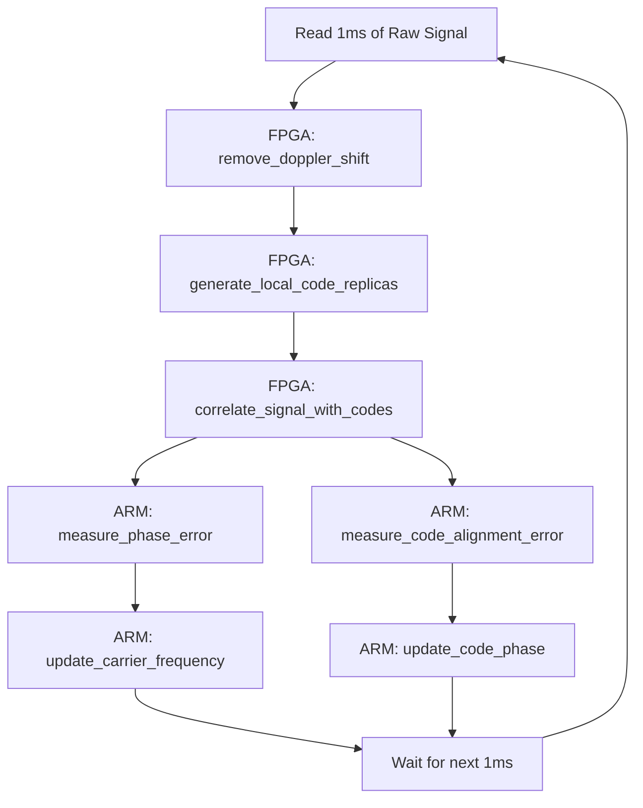

# Human-Readable GPS Tracking Algorithm

To bridge the gap between complex mathematics and human understanding, we have abstracted the math into named functions. This allows us to read the algorithm like a story, focusing on *what* the system is doing rather than the mathematical mechanics of *how* it does it.

## 1. The High-Level Flow Chart

Here is the tracking loop, using only the names of our human-readable functions:



## 2. The Pseudo-Code Algorithm

This is the main tracking loop written in plain English. It clearly separates what runs on the fast hardware (FPGA) and what runs on the slower control processor (ARM).

```python
def track_satellite_for_one_millisecond(raw_signal):
    
    # ==========================================
    # FPGA HARDWARE (High-Speed Processing)
    # ==========================================
    
    # Step 1: Wipe off the high-frequency radio carrier
    baseband_signal = remove_doppler_shift(raw_signal, current_frequency)
    
    # Step 2: Create local guesses of what the satellite code looks like
    early_code, prompt_code, late_code = generate_local_code_replicas(current_code_phase)
    
    # Step 3: Multiply and sum (correlate) to pull the GPS data out of the noise
    correlation_results = correlate_signal_with_codes(
        baseband_signal, 
        early_code, prompt_code, late_code
    )
    
    # ==========================================
    # ARM PROCESSOR (Low-Speed Control Loops)
    # ==========================================
    
    # Step 4: Check if our frequency guess was slightly off
    phase_error = measure_phase_error(correlation_results.prompt)
    update_carrier_frequency(phase_error)
    
    # Step 5: Check if our code alignment was slightly early or late
    alignment_error = measure_code_alignment_error(correlation_results.early, correlation_results.late)
    update_code_phase(alignment_error)
```

## 3. The Function Definitions (What happens inside)

Here are the "blank functions" that hide the complex math. If we ever need to see the math, we look inside these functions. Otherwise, we just trust the name of the function to tell us what it accomplishes.

```python
def remove_doppler_shift(raw_signal, estimated_frequency):
    """
    Creates local sine and cosine waves at the estimated_frequency.
    Multiplies the raw_signal by these waves to strip away the radio carrier.
    Returns the clean baseband signal.
    """
    pass # (Cosine/Sine generation and complex multiplication math goes here)

def generate_local_code_replicas(current_code_phase):
    """
    Generates three versions of the satellite's unique ID pattern (C/A code):
    - Early: Shifted slightly backward in time
    - Prompt: Exactly where we think the satellite is
    - Late: Shifted slightly forward in time
    """
    pass # (PRN shift and generation math goes here)

def correlate_signal_with_codes(baseband_signal, early, prompt, late):
    """
    Multiplies the baseband_signal by the early, prompt, and late codes.
    Sums up all 4,000 samples for each. If they match, the sum is a huge spike.
    Returns the energy levels for Early, Prompt, and Late.
    """
    pass # (NumPy dot-product arrays and accumulation math goes here)

def measure_phase_error(prompt_energy):
    """
    Looks at the Prompt energy. If it is completely "In-Phase", the error is 0.
    If it has bled into the "Quadrature" phase, we use trigonometry
    to calculate exactly how many degrees off we are.
    """
    pass # (Arctan and modulo math goes here)

def update_carrier_frequency(phase_error):
    """
    Takes the phase_error and passes it through a Phase Locked Loop (PLL) filter.
    Adjusts the estimated_frequency so we are more accurate in the next millisecond.
    """
    pass # (PLL loop filter multiplication math goes here)

def measure_code_alignment_error(early_energy, late_energy):
    """
    Compares the Early energy to the Late energy.
    If Early > Late, we are tracking too early.
    If Late > Early, we are tracking too late.
    """
    pass # (Energy comparison and division math goes here)

def update_code_phase(alignment_error):
    """
    Takes the alignment_error and passes it through a Delay Locked Loop (DLL) filter.
    Adjusts the current_code_phase so our code generator stays perfectly centered.
    """
    pass # (DLL loop filter multiplication math goes here)
```
