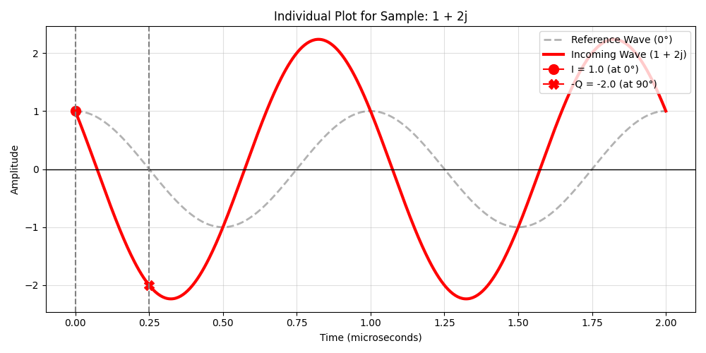
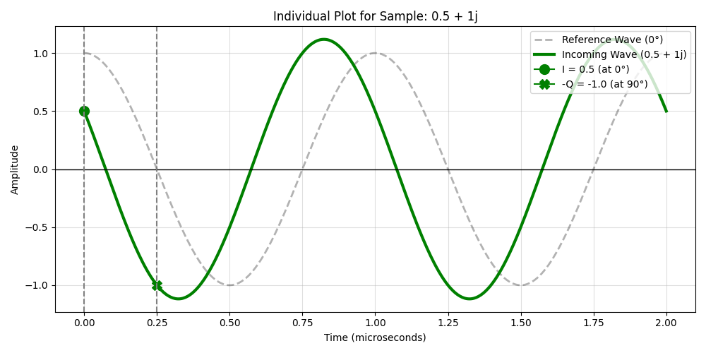
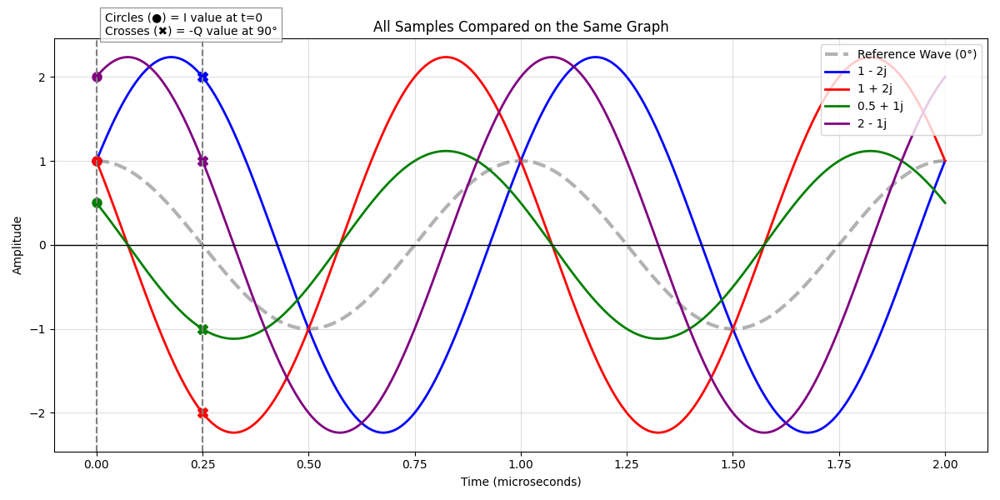

# Deep Dive: Plotting Individual Complex Samples

You asked to see a separate chart for each data point (`1-2j`, `1+2j`, `0.5+1j`, `2-1j`), and then one final chart combining all of them. 

This is the perfect way to understand exactly how the `I` (Real) and `Q` (Imaginary) numbers physically stretch and pull the radio wave.

In every graph below:
- The **Dashed Grey Line** is the Reference Wave ($0^\circ$).
- The **Solid Colored Line** is the actual physical wave created by your specific I/Q sample.
- The **Circle (●)** shows where the `I` value pins the wave at exactly Time = 0.
- The **Cross (✖)** shows where the `-Q` value pins the wave exactly $90^\circ$ later.

---

## 1. Sample: `1 - 2j` (Blue)
* **I = 1.0:** The wave must cross the Y-axis at exactly 1.0.
* **Q = -2.0:** The wave is pulled heavily to the right (a negative phase shift).

---

## 2. Sample: `1 + 2j` (Red)
* **I = 1.0:** The wave still crosses the Y-axis at exactly 1.0.
* **Q = +2.0:** Because Q is positive now, the wave is pulled heavily to the left (a positive phase shift).

> [!NOTE] 
> Compare the Red and Blue graphs! Their `I` value is identical (1.0), so they both start at the exact same height on the Y-axis. But because their `Q` signs are flipped, one is pulled left and the other is pulled right!

---

## 3. Sample: `0.5 + 1j` (Green)
* **I = 0.5**
* **Q = +1.0**

> [!TIP]
> Notice how the Green wave is exactly the same shape (same phase shift) as the Red wave (`1 + 2j`), but it is exactly **half as tall**! The ratio of I to Q ($1:2$ vs $0.5:1$) determines the phase, but the actual numbers determine the Amplitude (strength) of the signal.

---

## 4. Sample: `2 - 1j` (Purple)
* **I = 2.0:** The wave must start very high up, crossing the Y-axis at 2.0.
* **Q = -1.0:** The wave is pulled slightly to the right.

---

## 5. All Samples Combined

Finally, here are all four waves overlaid on the same graph so you can see their relative sizes and phase shifts.

By changing just two numbers (I and Q), we have complete control over the height (Amplitude) and the horizontal shift (Phase) of the radio wave.
