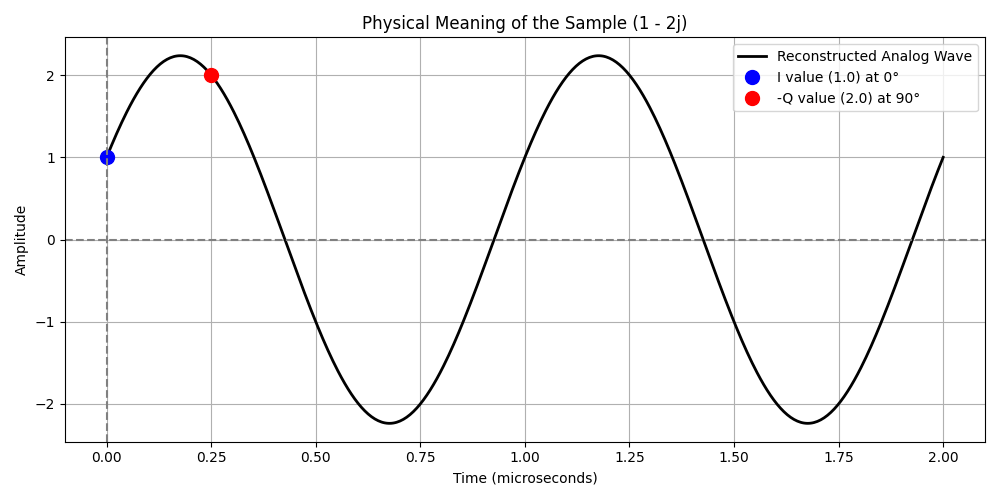

# I/Q Sampling: Clearing the Confusion

Let's clear up the confusion immediately! The previous plot was misleading because the blue (I) and red (Q) dots were overlapping, making it look like they were sampled at different times.

**Crucial Fact #1:** I and Q are sampled at the **exact same instant in time**. For every microsecond, the hardware takes ONE snapshot, but that snapshot is split into two dimensions (I and Q).

---

## 1. What does a single sample like "1 - 2j" actually mean?

You asked: *"So if I have got this data 1i-2j, what does it mean? Show me this on a graph overlaid on a sine with sample lines."*

In our software, `1 - 2j` is a complex number where:
- **I (In-Phase / Real part) = 1.0**
- **Q (Quadrature / Imaginary part) = -2.0**

But what does this mean in the physical world? A single complex sample like `1 - 2j` actually defines an **entire continuous radio wave** for that instant. It tells us the exact Amplitude and the exact Phase (starting angle) of the wave.

Here is the plot showing the exact physical radio wave that `1 - 2j` represents:

> [!NOTE]
> Look at the blue dot at Time = 0. The actual height of the analog wave is exactly **1.0**. This is your **I** value! The **Q** value of -2.0 determines how far the wave is shifted horizontally, which you can see dictates the height of the wave at the 90° mark.

By passing `1 - 2j` into our FPGA, we have perfectly described that entire grey continuous wave using just two numbers.

---

## 2. Seeing a Phase Shift (BPSK Modulation)

You asked: *"I want to see this when there is a modulation of phase shift and the effect on the I and Q values."*

GPS uses a modulation technique called **BPSK** (Binary Phase Shift Keying). When a satellite wants to transmit a bit of data, it abruptly flips the radio wave upside down (a 180-degree phase shift). 

Let's look at a continuous wave that flips 180 degrees at the 3-microsecond mark. To avoid the overlapping confusion, I have separated the **I samples** and **Q samples** onto their own graphs so you can see exactly how they react simultaneously.

> [!TIP]
> **Look at the Orange Line!** When the analog wave flips upside down, the I and Q samples instantly flip their signs too. This is exactly how the FPGA reads the GPS Navigation Data: it looks for these sudden inversions in the I/Q data stream.
