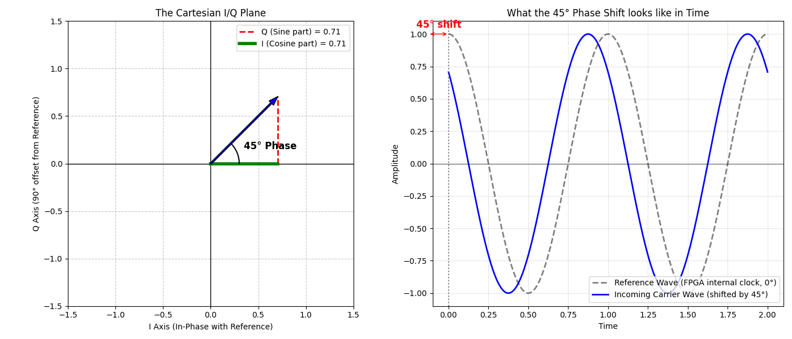

# What exactly is "Phase"?

You asked some incredibly profound questions that cut straight to the core of radio engineering:
1. *What is phase really here with respect to? Compare it to what?*
2. *I plot a line at a 45-degree angle. What does it mean?*
3. *Does this line belong to the carrier wave or the data?*

Let's break these down one by one, using a visual graph to anchor the concepts.

---

## 1. Phase is ALWAYS a Comparison
Phase does not exist in a vacuum. It is a measurement of **Time Delay** expressed as an angle. 

When we say a wave has a "45-degree phase," you must immediately ask: *"45 degrees compared to what?"*

In our GPS receiver, the phase is compared to the **FPGA's internal clock (The Reference Wave)**. 
- The FPGA generates its own perfect, internal cosine wave. We call this $0^\circ$.
- If the incoming satellite wave peaks at the exact same microsecond as the FPGA's wave, they are "in-phase" ($0^\circ$).
- If the incoming wave peaks slightly *earlier* or *later* than the FPGA's wave, that delay is the **Phase Shift**.

## 2. What does a 45-Degree Line on a Graph Mean?

When you plot a line on Cartesian coordinates (the I/Q plane), here is exactly what you are drawing:

> [!NOTE]
> **Left Graph (The Cartesian I/Q Plane):** 
> - The **X-Axis (I)** represents our FPGA's internal Cosine wave ($0^\circ$).
> - The **Y-Axis (Q)** represents our FPGA's internal Sine wave ($90^\circ$).
> - **The Blue Line:** This represents the incoming satellite wave at a specific microsecond. The fact that it is pointing at $45^\circ$ means it is a perfect 50/50 mixture of our Cosine and Sine waves. 

> [!TIP]
> **Right Graph (The Time Domain):**
> This shows *why* the line is at $45^\circ$. Look at the black dashed line (our FPGA's internal $0^\circ$ reference). Now look at the blue incoming wave. The blue wave is shifted to the left by a tiny fraction of time. That physical time delay *is* the 45-degree phase shift!

## 3. Does the line belong to the Carrier Wave or the Data?

This is the most important question. 

The blue line on the graph represents the **Carrier Wave**. The length of the line is the amplitude (strength) of the 1.575 GHz radio wave, and the angle is its physical time delay.

**So where is the Data?**
The data is not the line itself. The data is the **Movement** of the line.

Imagine you are watching that blue line on the graph update in real-time, millions of times a second:
1. **No Data (or constant '1'):** The blue line sits perfectly still at $45^\circ$.
2. **Doppler Shift:** The satellite is moving, which slightly changes the frequency of the carrier wave. You will see the blue line slowly rotating like the second-hand on a clock. 
3. **The Data (BPSK Modulation):** Suddenly, the satellite wants to transmit a binary `0`. To do this, it instantly flips the carrier wave upside down. On your graph, the blue line will violently snap from pointing up-right ($45^\circ$) to pointing down-left ($225^\circ$). 

**The sudden $180^\circ$ flip of the Carrier Wave *is* the Data.** Our FPGA's tracking loops (the Python math we looked at earlier) are designed to constantly watch that blue line, stop it from slowly rotating (Doppler Wipe-off), and wait for it to suddenly snap backward (Reading the Data).
